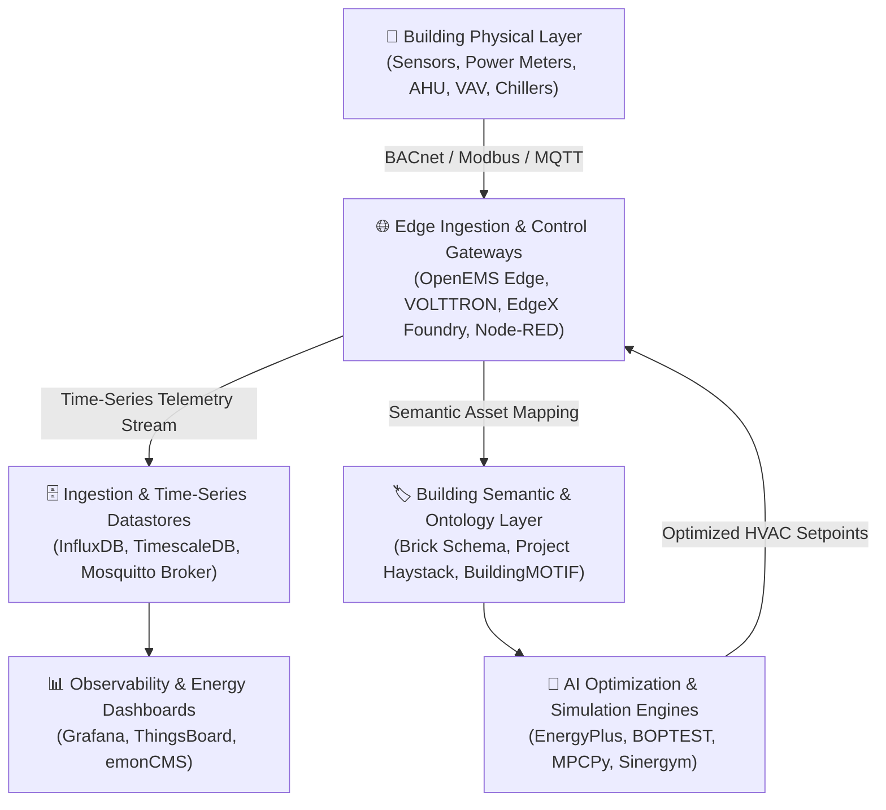

  
    
  

    
    
    
    
    
    
    
  

  
<strong>A comprehensively curated catalog of SaaS platforms, open-source software, IoT frameworks, time-series data engines, digital twins, and AI control stacks for Building Performance Monitoring (BPM), Energy Management (EMS), and HVAC Optimization.</strong>

---

## 📑 Table of Contents

- [🌟 Overview](#-overview)
- [🏢 SaaS & Hosted Commercial Platforms](#-saas--hosted-commercial-platforms)
- [💻 Open-Source GitHub Projects](#-open-source-github-projects)
- [🏗️ Architectural Blueprint for Self-Hosted BPM](#️-architectural-blueprint-for-self-hosted-bpm)
- [🤝 How to Contribute](#-how-to-contribute)
- [⭐ Star History](#-star-history)
- [📄 License & Disclaimer](#-license--disclaimer)

---

## 🌟 Overview

**Building Performance Monitoring (BPM)** and **Building Energy Management Systems (BEMS)** encompass technologies and frameworks designed to measure, analyze, visualize, and optimize physical infrastructure. These tools aggregate telemetry across:

- ⚡ **Energy & Utility Telemetry**: Submetering, power quality, gas, water, peak-demand forecasting, and load profiles.
- ❄️ **HVAC & Thermal Comfort**: Real-time chiller/boiler telemetry, VAV/AHU diagnostics, IAQ (CO₂, TVOC, PM2.5), and automated setpoint control.
- 🔍 **Fault Detection & Diagnostics (FDD)**: Automated root-cause analysis, mechanical fault detection, and predictive maintenance schedules.
- 🏢 **Digital Twins & Semantic Metadata**: Ontologies including [Brick Schema](https://brickschema.org/) and [Project Haystack](https://project-haystack.org/) to standardize physical-to-digital mapping.
- 🌱 **Decarbonization & ESG Reporting**: Scope 1, 2, and 3 carbon accounting, ENERGY STAR benchmarking, and sustainability compliance.

---

## 🏢 SaaS & Hosted Commercial Platforms

> **Note:** Sorted descending by company size (market capitalization, enterprise valuation, and reported annual revenue). Starting tier pricing and specific trial limits are detailed below.

| 🏢 Platform | 📈 Company Size & Revenue | 💵 Starting Pricing | 🎁 Free Tier / Trial Limits | 📝 Overview & Core Focus |
| :--- | :--- | :--- | :--- | :--- |
| **[Siemens Building X](https://www.siemens.com/global/en/products/buildings/building-x.html)** | **~$170B Market Cap** *(Siemens AG)* ~$80B+ Annual Revenue | Modular apps start at **~$120 – $250/month per application/site** (12-month advance subscription; gateways sold separately) | **6-Month Free Trial**: Full functionality access for 1 site on core services (such as Building X Energy Manager). | Modular cloud platform integrating energy management, operations, digital services, and smart building applications. |
| **[Schneider Electric EcoStruxure Building](https://www.se.com/ww/en/work/solutions/for-business/smart-buildings/)** | **~$140B Market Cap** *(Schneider Electric)* ~$38B+ Annual Revenue | Starts at **~$5,000 – $10,000/year per server/site license** (modular cloud SaaS add-ons from **~$100/month**) | **30-Day Free Trial**: Available for select EcoStruxure cloud apps (e.g., EcoStruxure IT and remote access); guided pilot for Building Operation. | Connected building ecosystem providing BMS automation, energy monitoring, HVAC control, and workplace efficiency. |
| **[Honeywell Forge](https://www.honeywell.com/us/en/honeywell-forge)** | **~$130B Market Cap** *(Honeywell Intl)* ~$37B+ Annual Revenue | Starts at **~$15,000/year** for core enterprise modules (modular cloud applications start from **~$150/site/month**) | **30-Day Free Trial**: Available for select modular cloud applications (such as Visitor and Space Management); guided demo pilot for APM. | Enterprise building and asset performance platform providing predictive maintenance, energy optimization, and operational intelligence. |
| **[Johnson Controls OpenBlue](https://www.johnsoncontrols.com/openblue)** | **~$50B Market Cap** *(Johnson Controls)* ~$27B+ Annual Revenue | Starts at **~$10,000 – $20,000/year** (1 to 3-year cloud subscription tiers based on connected building assets and square footage) | **30-Day Pilot Program**: Guided proof-of-concept deployment with connected chillers/HVAC systems and performance dashboards. | Connected-building suite combining digital twins, AI-driven energy optimization, indoor air quality management, and building automation. |
| **[BuildingMinds](https://www.buildingminds.com/)** | **~$28B Market Cap** *(Parent: Schindler)* ~$10M+ SaaS ARR | Starts at **€19.90/building/month** (Self-Service plan, billed monthly); Enterprise volume tiers available upon consultation | **14-Day Free Trial**: Full access to the self-service platform for portfolio onboarding, AI document ingestion, and energy/carbon reporting. | Building-management and digital-twin platform connecting space data, energy performance, decarbonization pathways, and ESG intelligence. |
| **[Spacewell](https://spacewell.com/)** | **~$11B Market Cap** *(Parent: Nemetschek)* ~$50M+ ARR | Starts at **~$1.50 – $3.00/sensor or asset/month** (annual platform subscription packages starting from **~$5,000/year**) | **14 to 30-Day Pilot Trial**: Sandbox environment with live sample sensor integration and workplace energy analytics upon request. | Smart-building and workplace-management platform combining IoT occupancy sensing, energy management, and maintenance automation. |
| **[Measurabl](https://www.measurabl.com/)** | **~$350M Valuation** ($93M+ Funding Raised) • ~$30M+ ARR | Free basic plan; Premium tiers start at **~$45 – $75/building/month** (~$5,995/year starting package for portfolio tracking) | **Free Forever plan**: Permanent access to core ESG tracking, utility data organization, global benchmarking, and baseline reporting for property assets. | Sustainability and ESG data-management platform for commercial real estate benchmarking, decarbonization, utility data, and regulatory reporting. |
| **[BrainBox AI](https://brainboxai.com/)** | **~$250M Valuation** ($60M+ Funding Raised) | Starts at **~$0.25/sq. ft./year** (SaaS subscription model billed annually based on building HVAC tonnage/capacity) | **30 to 60-Day Pilot Program**: Proof-of-concept deployment on target HVAC units to measure and validate baseline energy reduction before contract rollout. | Autonomous AI platform connecting directly to commercial HVAC systems to optimize heating/cooling in real-time and cut energy consumption. |
| **[GridPoint](https://www.gridpoint.com/)** | **~$200M Valuation** ($150M+ Capital Raised) • ~$40M+ ARR | Starts at **~$200 – $500/location/month** (subscription bundle covering cloud platform, controllers, and monitoring services) | **Free Energy Assessment**: Complete site audit, load profile review, and energy reduction ROI analysis (no software self-trial). | Energy-Management-as-a-Service (EMaaS) platform delivering automated HVAC control, submetering, and demand response. |
| **[Facilio](https://facilio.com/)** | **~$175M Valuation** ($40M+ Series B Funding) • ~$20M+ ARR | Starts at **~$10,000/year** (~$833/month) based on named user tiers and standard module deployment with annual billing | **Free Trial on Request**: 14 to 30-day proof-of-concept/pilot environment with full feature access and sample connected asset data. | Cloud-based building operations and facility-management platform connecting IoT devices, maintenance workflows, energy data, and operational analytics. |
| **[EnergyCAP](https://www.energycap.com/)** | **~$120M Valuation** (Resurgens PE Backed) • ~$25M+ ARR | Starts at **~$4,000 – $5,000/year** (approximately **~$10 – $25/meter/year** for Standard Edition; Enterprise tiers from **~$13,000/year**) | **14 to 30-Day Free Trial**: Guided onboarding trial with test utility bill ingestion, meter configuration, and rate schedule analysis. | Utility bill management, energy tracking, carbon emissions accounting, and facility benchmarking platform. |
| **[75F](https://www.75f.io/)** | **~$100M Valuation** ($40M+ Funding Raised - Gates BEV) | Starts at **~$0.05 – $0.15/sq. ft./year** (or **~$150 – $300/controller/year** cloud subscription + IoT hardware) | **Free Energy Assessment & 30-Day Pilot**: Free building thermal analysis and 30-day trial pilot for commercial HVAC zones. | Full-stack IoT building automation and predictive HVAC management platform with cloud analytics. |
| **[Aquicore](https://aquicore.com/)** | **~$60M Valuation** ($20M+ Funding Raised) • ~$15M+ ARR | Starts at **~$500 – $1,000/building/month** (annual portfolio contracts starting at **~$6,000/year**) | **30-Day Free Pilot**: Guided trial on 1–2 utility meters or building accounts with automated data capture and peak demand analysis. | Energy management and building analytics platform providing automated utility tracking, tenant submeter billing, and ENERGY STAR benchmarking. |
| **[Verdigris](https://www.verdigris.co/)** | **~$50M Valuation** ($20M+ Funding Raised) | Starts at **~$300 – $500/site/month** (or capacity-based enterprise pricing from **~$1,000/MW/year** + hardware sensor pack) | **30-Day Pilot Evaluation**: Guided pilot program on electrical panels with high-frequency CT sensors and AI anomaly detection reports. | AI-enabled high-frequency electrical energy monitoring platform providing circuit-level telemetry and automated fault detection. |
| **[Enertiv](https://enertiv.com/)** | **~$50M Valuation** ($15M+ Funding Raised) • ~$10M+ ARR | Starts at **~$0.02 – $0.05/sq. ft./year** for commercial assets or **~$1 – $3/unit/month** for residential/multifamily portfolios (+ onboarding fee) | **Free Trial / Guided Pilot**: 30-day evaluation pilot on selected equipment/submeters with onboarding assessment. | Building operations and energy-monitoring platform offering real-time equipment tracking, utility submetering, and predictive maintenance. |
| **[Clockworks Analytics](https://clockworksanalytics.com/)** | **~$45M Valuation** ($15M+ Funding Raised) • 4,000+ Buildings | Starts at **~$0.03 – $0.08/sq. ft./year** (or **~$5,000 – $15,000/building/year** based on connected HVAC point count) | **30-Day Diagnostic Pilot**: Guided trial connecting to existing BMS data to detect and prioritize mechanical faults and energy waste. | Automated fault detection and diagnostics (FDD) platform analyzing HVAC systems and building energy telemetry. |
| **[DEXMA](https://www.dexma.com/)** | **~$35M Valuation** (Acquired by Spacewell / Nemetschek) | Starts at **~$25 – $50/data point/year** (or **~€100 – €300/meter/month** for standard energy analytics cloud tiers) | **30-Day Free Trial**: Full-access trial account with demo energy datasets, automated reporting, and anomaly detection rules. | Energy intelligence and analytics platform providing automated monitoring, forecasting, artificial intelligence alarms, and submetering. |
| **[Switch Automation](https://www.switchautomation.com/)** | **~$30M Valuation** ($10M+ Funding Raised) | Starts at **~$0.015 – $0.03/sq. ft./year** (entry portfolio packages starting from **~$12,000/year**) | **30-Day Free Trial**: Guided proof-of-concept pilot for qualified real estate portfolios including data ingestion and dashboarding. | Smart building performance platform integrating BMS, IoT telemetry, and operational data for energy optimization and asset management. |
| **[KGS Buildings](https://www.kgsbuildings.com/)** | **~$15M Valuation** (Part of Clockworks Analytics) | Starts at **~$0.03 – $0.08/sq. ft./year** (scaled by connected equipment and square footage) | **30-Day Trial Pilot**: Initial fault detection analysis and guided software trial connecting to mechanical telemetry. | Building analytics and HVAC performance diagnostics platform (part of the Clockworks Analytics platform). |

---

## 💻 Open-Source GitHub Projects

> **Note:** Sorted descending by GitHub star count. Star badges link directly to the stargazers page of each repository.

- **[Home Assistant](https://github.com/home-assistant/core)**   
  Open-source home and building automation platform with thousands of device integrations, real-time energy monitoring dashboards, sensor telemetry pipelines, and flexible automation logic.

- **[Grafana](https://github.com/grafana/grafana)**   
  Leading open-source observability, dashboarding, and metric visualization platform widely used for real-time building energy consumption, HVAC equipment metrics, and indoor environmental condition telemetry.

- **[Prometheus](https://github.com/prometheus/prometheus)**   
  Open-source monitoring system and time-series database with a multi-dimensional metric model and powerful PromQL query language, ideal for alerting and collecting time-series metrics from building systems and IoT gateways.

- **[InfluxDB](https://github.com/influxdata/influxdb)**   
  High-performance time-series datastore purpose-built for collecting, storing, and analyzing real-time building sensor streams, energy submeter intervals, and HVAC telemetry.

- **[Node-RED](https://github.com/node-red/node-red)**   
  Low-code flow-based programming environment for IoT hardware devices, APIs, and building protocols (BACnet, Modbus, MQTT) to wire building data pipelines visually.

- **[TimescaleDB](https://github.com/timescale/timescaledb)**   
  PostgreSQL-native time-series database optimized for fast ingest, complex analytical queries, and relational context for smart building telemetry and device metadata.

- **[ThingsBoard](https://github.com/thingsboard/thingsboard)**   
  Open-source IoT platform for device management, telemetry data collection, interactive dashboards, rules engine, and alarm processing in smart facilities.

- **[Telegraf](https://github.com/influxdata/telegraf)**   
  Plugin-driven server agent for collecting, processing, and aggregating metrics from building automation systems, IoT sensors, databases, and networks.

- **[Eclipse Mosquitto](https://github.com/eclipse-mosquitto/mosquitto)**   
  Lightweight open-source MQTT message broker implementing MQTT v5.0/v3.1.1 protocols, providing foundational publish-subscribe messaging for smart building sensors.

- **[Open-Meteo Weather API](https://github.com/open-meteo/open-meteo)**   
  Open-source weather API providing solar radiation, temperature, humidity, and atmospheric forecasts essential for predictive building HVAC control and energy modeling.

- **[OpenMQTTGateway](https://github.com/1technophile/OpenMQTTGateway)**   
  Open-source gateway for bidirectional communication between 433MHz, BLE, LoRa, and wireless environmental sensors into MQTT building data pipelines.

- **[OpenRemote](https://github.com/openremote/openremote)**   
  100% open-source IoT and smart building platform with automated rules, asset models, energy management applications, and mobile dashboard support.

- **[pvlib python](https://github.com/pvlib/pvlib-python)**   
  Community-developed Python toolbox containing physics-based functions and models for simulating the performance of building-integrated photovoltaic (BIPV) energy systems.

- **[EnergyPlus](https://github.com/NREL/EnergyPlus)**   
  Flagship open-source whole-building energy simulation engine developed by NREL and the U.S. Department of Energy for modeling heating, cooling, lighting, ventilating, and energy flows.

- **[EdgeX Foundry](https://github.com/edgexfoundry/edgex-go)**   
  Highly modular vendor-neutral open-source edge IoT middleware platform for interfacing industrial devices and building equipment at the edge.

- **[OpenEMS (Open Source Energy Management System)](https://github.com/OpenEMS/openems)**   
  Modular open-source energy management system providing Edge, UI, and Backend components to monitor, optimize, and control energy storage, PV, EV chargers, and heat pumps.

- **[emonCMS](https://github.com/emoncms/emoncms)**   
  Open-source web application for processing, logging, and visualizing electricity, heat pump, temperature, and environmental telemetry from OpenEnergyMonitor hardware.

- **[openHAB Core](https://github.com/openhab/openhab-core)**   
  Extensible vendor-agnostic smart automation framework supporting hundreds of building communication protocols, automation rules, and persistence layers.

- **[NILMTK (Non-Intrusive Load Monitoring Toolkit)](https://github.com/nilmtk/nilmtk)**   
  Non-Intrusive Load Monitoring Toolkit (NILMTK) in Python designed to disaggregate whole-building electricity consumption into individual appliance loads.

- **[Eclipse Ditto (IoT Digital Twins)](https://github.com/eclipse-ditto/ditto)**   
  Open-source digital-twin framework within the Eclipse IoT ecosystem for creating digital representations of physical building assets and IoT sensors.

- **[Simple PID Controller](https://github.com/m-lundberg/simple-pid)**   
  Easy-to-use Python implementation of a PID controller, suitable for custom HVAC damper, temperature, and actuator control loop automation.

- **[OpenStudio SDK](https://github.com/NREL/OpenStudio)**   
  Cross-platform collection of software tools and SDKs that support whole-building energy modeling, daylighting analysis, and parametric simulation with EnergyPlus.

- **[BACnet Protocol Stack (C Library)](https://github.com/bacnet-stack/bacnet-stack)**   
  Open-source BACnet protocol stack in C providing BACnet application, network, and data link layers (BACnet/IP, MS/TP) for building automation controllers.

- **[Brick Schema (Semantic Building Ontology)](https://github.com/BrickSchema/Brick)**   
  Standardized semantic metadata ontology for representing building assets, equipment subsystems, sensor telemetry points, spaces, and spatial relationships.

- **[Modelica Buildings Library](https://github.com/lbl-srg/modelica-buildings)**   
  Free open-source Modelica library developed by Lawrence Berkeley National Lab (LBNL) for dynamic simulation of building and district energy and control systems.

- **[BACpypes (Python BACnet Stack)](https://github.com/JoelBender/bacpypes)**   
  Python library providing application, network, and transport layers for the BACnet communication protocol to interface software with building automation hardware.

- **[emonPi (OpenEnergyMonitor Hardware/Firmware)](https://github.com/openenergymonitor/emonpi)**   
  Open-source Raspberry Pi-based hardware and firmware energy monitoring hub for real-time home and commercial electrical submetering.

- **[City Energy Analyst (CEA)](https://github.com/architecture-building-systems/CityEnergyAnalyst)**   
  Urban building energy simulation platform for district energy systems, building performance assessment, and urban decarbonization scenario analysis.

- **[BAC0 (Python BACnet Scripting & Automation)](https://github.com/ChristianTremblay/BAC0)**   
  Python scripting library wrapping BACnet communication to automate HVAC commissioning, point discovery, trend logging, and BMS data analysis.

- **[Sinergym (Reinforcement Learning for Building Control)](https://github.com/ugr-sail/sinergym)**   
  Reinforcement learning environment for building simulation and intelligent HVAC control leveraging EnergyPlus and Gymnasium interfaces.

- **[Eppy (EnergyPlus Scripting in Python)](https://github.com/santoshphilip/eppy)**   
  Python scripting language and object model for programmatically reading, editing, and automating EnergyPlus IDF building energy input files.

- **[Fledge (Industrial & Building Edge IoT)](https://github.com/fledge-iot/fledge)**   
  Open-source industrial IoT edge architecture designed for data ingestion, filtering, and transformation from harsh sensor networks and building mechanical rooms.

- **[BOPTEST (Building Optimization Performance Test Framework)](https://github.com/ibpsa/project1-boptest)**   
  Building Optimization Performance Test (BOPTEST) framework for benchmarking and evaluating advanced building control algorithms against simulation baselines.

- **[MPCPy (Model Predictive Control for Buildings)](https://github.com/lbl-srg/MPCPy)**   
  Open-source Python framework for simulating and implementing model predictive control (MPC) in building energy and HVAC systems.

- **[BuildingsPy (Modelica Automation Tools)](https://github.com/lbl-srg/BuildingsPy)**   
  Python package containing utilities for managing, executing, and analyzing Modelica building simulations and unit tests.

- **[BuildingMOTIF (Semantic Model Validation)](https://github.com/NREL/BuildingMOTIF)**   
  Building Metadata OnTology Interoperability Framework for authoring, validating, and translating semantic building models (Brick, 223P, Haystack).

- **[Mainflux IoT Platform](https://github.com/mainflux/mainflux)**   
  Secure open-source industrial IoT device management and messaging platform with support for MQTT, CoAP, and HTTP building telemetry.

- **[Open Energy Platform (OEP)](https://github.com/OpenEnergyPlatform/oeplatform)**   
  Open Energy Platform community web portal and database infrastructure for energy system modeling, metadata standards, and research datasets.

- **[Alfalfa (Building Simulation API & Co-Simulation)](https://github.com/NREL/alfalfa)**   
  Web service and API enabling real-time interactive control and co-simulation of building energy models using EnergyPlus and OpenStudio.

- **[OpenStudio Server](https://github.com/NREL/openstudio-server)**   
  Distributed computing framework (Docker/Helm deployable) for executing large-scale parametric EnergyPlus and OpenStudio building energy simulations.

- **[Honeybee Core (Building Geometry & Simulation)](https://github.com/ladybug-tools/honeybee-core)**   
  Python library for creating and managing detailed building geometries and energy/daylighting models for simulation workflows.

- **[EmonScripts (emonCMS Auto-installer)](https://github.com/openenergymonitor/EmonScripts)**   
  Automated setup and deployment scripts for installing the emoncms energy management stack on Linux and single-board computers.

- **[VOLTTRON AEMS (Autonomous Energy Management System)](https://github.com/VOLTTRON/volttron-pnnl-aems)**   
  Autonomous Energy Management Software (AEMS) built on VOLTTRON for intelligent HVAC rooftop unit control and demand-response automation.

- **[monitorEMS (OpenEMS + InfluxDB + Grafana)](https://github.com/signag/monitorEMS)**   
  Open-source telemetry collector that captures monitoring data from OpenEMS systems into InfluxDB for Grafana building performance dashboards.

---

## 🏗️ Architectural Blueprint for Self-Hosted BPM

Building a full-stack, enterprise-grade open-source building performance monitoring architecture combines modular layers:

### 🛠️ Core Technology Matrix

- 🔌 **Field Connectivity Protocols**: `BACnet/IP`, `BACnet MS/TP` ([bacnet-stack](https://github.com/bacnet-stack/bacnet-stack), [BAC0](https://github.com/ChristianTremblay/BAC0), [BACpypes](https://github.com/JoelBender/bacpypes)), `Modbus TCP/RTU` ([pymodbus](https://github.com/pymodbus-dev/pymodbus)), `MQTT` ([Mosquitto](https://github.com/eclipse-mosquitto/mosquitto)), `OPC-UA`.
- ⚙️ **Edge Control & Gateway Run-times**: [OpenEMS](https://github.com/OpenEMS/openems), [VOLTTRON](https://github.com/VOLTTRON/volttron), [OpenRemote](https://github.com/openremote/openremote), [EdgeX Foundry](https://github.com/edgexfoundry/edgex-go), [Node-RED](https://github.com/node-red/node-red).
- 🏷️ **Semantic Data Models**: [Brick Schema](https://github.com/BrickSchema/Brick), [Project Haystack](https://project-haystack.org/), [BuildingMOTIF](https://github.com/NREL/BuildingMOTIF).
- 🗃️ **High-Frequency Time-Series Storage**: [InfluxDB](https://github.com/influxdata/influxdb), [TimescaleDB](https://github.com/timescale/timescaledb), [Prometheus](https://github.com/prometheus/prometheus).
- 📈 **Visualization & Telemetry Dashboards**: [Grafana](https://github.com/grafana/grafana), [ThingsBoard](https://github.com/thingsboard/thingsboard), [emonCMS](https://github.com/emoncms/emoncms).
- 🌡️ **Building Energy Simulation & AI**: [EnergyPlus](https://github.com/NREL/EnergyPlus), [OpenStudio](https://github.com/NREL/OpenStudio), [Modelica Buildings](https://github.com/lbl-srg/modelica-buildings), [BOPTEST](https://github.com/ibpsa/project1-boptest), [Sinergym](https://github.com/ugr-sail/sinergym), [MPCPy](https://github.com/lbl-srg/MPCPy).

---

## 🤝 How to Contribute

Contributions from building automation engineers, facility managers, researchers, and open-source developers are very welcome! 🚀

1. 🍴 **Fork the repository**.
2. 🌿 **Create a new branch** (`git checkout -b feature/add-new-tool`).
3. ✍️ **Add or edit entries** in `README.md` following the tabular format for SaaS platforms or star-badged listing for open-source repos.
4. 📋 Ensure accurate links, detailed descriptions, and transparent pricing / trial limits.
5. 📬 **Submit a Pull Request** with a concise description of the addition.

Check out our overarching list: [Awesome Awesome Awesome](https://github.com/ishandutta2007/Awesome-Awesome-Awesome)! 🌟

---

## ⭐ Star History

---

## 📄 License & Disclaimer

- ⚖️ **License**: Distributed under the MIT License.
- 💡 **Disclaimer**: This is a community-curated directory intended for educational, operational, and research benchmarking. All product names, logos, and brands are property of their respective owners. Mention of commercial vendors does not constitute an endorsement.
